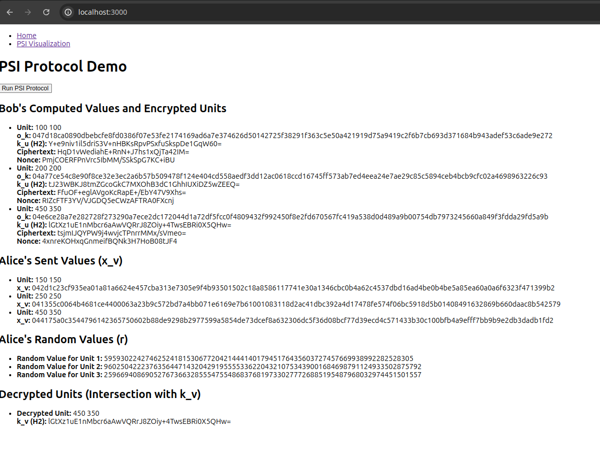
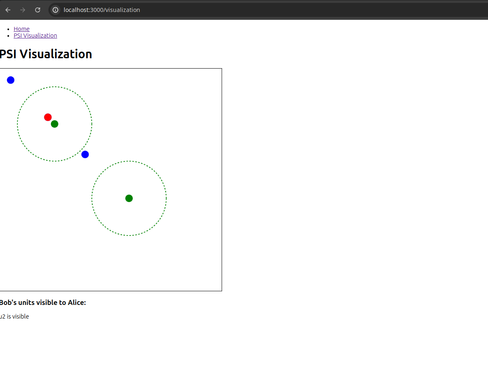

# Private Set Intersection Demo

A minimally working demonstration of a Private Set Intersection (PSI).

The aim is to prove this can work in a Real Time Strategy game, as shown in the research paper [OpenConflict: Preventing Real Time Map Hacks in Online Games](https://www.shiftleft.org/papers/openconflict/).

## Description
This code is a simple demonstration of how PSI calculations work. It is currently missing the symmetric encryption part, however, that is trivial given that generating the shared keys from the private interections is difficult.

An obvious next step is to add the encryption steps. That would make the code on par (roughly) with the PSI protocol in the OpenConflict paper.

One deficiency of the OpenConflict solution is that it has no protection against players who lie about their positions or visibility. I think the problem of lying is one that can be solved. Essentially, the players would reveal their all their position and visibility sets at the end of the game. Then players can check those against the rules of the game to ensure the calculations were correct and fit with the physics of the game.

Additionally, there would need to be a dispute resolution protocol on order to adjudicate in times when one player disagrees with another. This would happen when one player cheats and then denies it.

The overall top-level strategy is outlined in a blog I wrote in June 2020: [Preventing cheaters in Fog Of War Games](https://edward-thomson.medium.com/preventing-cheaters-in-fog-of-war-games-69f202fbe107).

### PSI Explainer
I put together a page that explains more of the details of what PSI is and how it works: [PSI Explainer](./explanations/psi_explainer.md).

## Using This App

### Home Page
A demonstration of the protocol working. The units and visibility are static / simple points. Just hit the "Run" button. 



### PSI Visualization
This is a simple visualization of simple point particles moving around inside a box (Bob's units). The visibility circles are static but sweep out a 2D area unlike the test on the home page. The code is inefficient at the moment but it shows that the protocol works with dynamic movement. The PSI code triggers every 5 seconds and is very slow to calculate (**causes huge visualization lag**).

In order to boost performance, the app converts positions and visibility to cells, which are a coarser representation of the pixels. 1 cell is 50x50 pixels.

There are peerhaps two main sources of inefficiency, one is that the app generates random values at every point in a secure yet inefficient way (the private key from a key pair), and secondly that the code has to decrypt all packets with every movement.

The first can be solved by generating one random value then hashing it for the other points. The second may require reducing key size since the period of a game only requires secrecy for a few hours at most in an RTS. Slower games don't require fast visualization, so it would be fine to have such key-length redundancy (consider strategy games like Civilization).



There are is a traditional visibility calculation that is helpful to calibrate what should be seen. You should really open the console log to check the results.

## Installation

1. Clone the repository:

```bash
 git clone https://github.com/EdwardAThomson/psi-demo.git
 cd psi-demo
```

2. Install dependencies:

```bash
 npm install
```


3. Run the app:

```bash
 npm start
```

This will start the app at http://localhost:3000.


## License
This project is licensed under the Apache 2.0 License - see the [LICENSE](LICENSE) file for details.


## Acknowledgements
Many thanks to the following people:

- Anuj Gupta, the researcher who shared this idea with me.
- ChatGPT
- Everyone at the Decentralized Gaming Association [DGA Discord](https://discord.com/invite/eZEVrSd)
