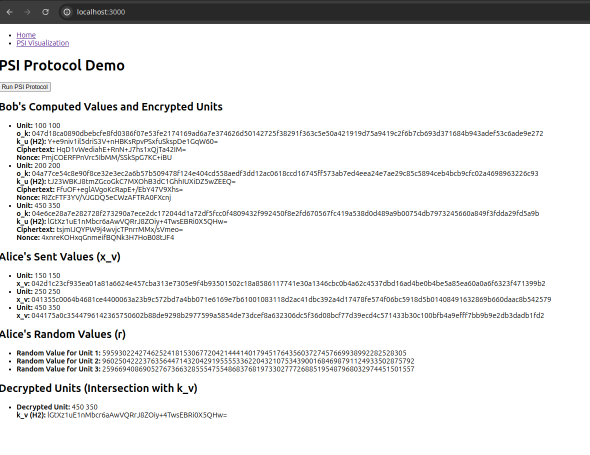
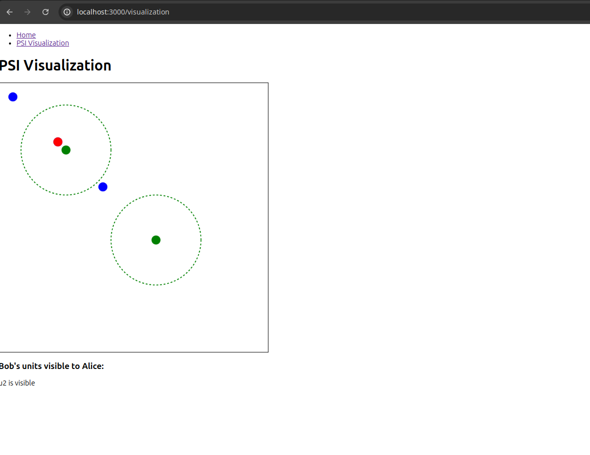
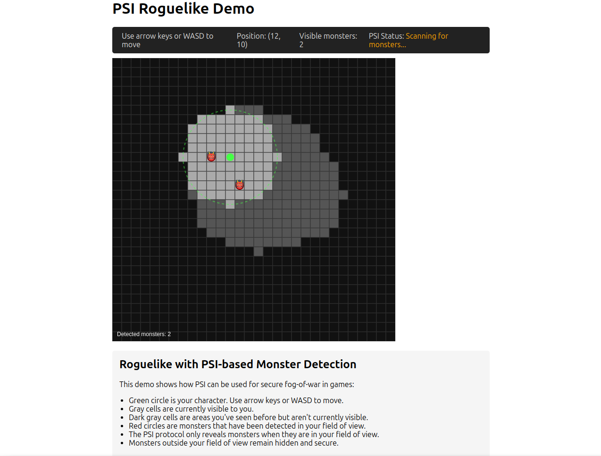

# Private Set Intersection Demo

A minimally working demonstration of a Private Set Intersection (PSI).

The aim is to prove this can work in a Real Time Strategy game, as shown in the research paper [OpenConflict: Preventing Real Time Map Hacks in Online Games](https://www.shiftleft.org/papers/openconflict/).

There is a live demo here: [PSI Demo @ Vercel](https://psi-demo-delta.vercel.app/).

See the [project roadmap](./ROADMAP.md) for what's shipped and what's planned next.

**Recent updates:** Ported two security fixes and a protocol improvement from the C++ port ([Private-Set-Intersection](https://github.com/EdwardAThomson/Private-Set-Intersection)). The hash-to-group function now produces points with unknown discrete log (ristretto255 element derivation from SHA-512, matching libsodium's `crypto_core_ristretto255_from_hash`); the old `H(x)*G` construction let a participant recover `b*G` from one run and enumerate the other set offline. Wire messages no longer carry any plaintext element; they contain only fixed 32-byte values (membership tags, blinded points, transformed points). Bob now sends one-way BLAKE3 membership tags instead of ciphertexts, so finalisation is O(A) hash lookups with no trial decryption. This is a breaking wire-format change.

**Threat model:** the protocol is private against honest-but-curious participants; a malicious participant can probe membership with fabricated inputs.

## Description
This code is a simple demonstration of how PSI calculations work.

One deficiency of the OpenConflict solution is that it has no protection against players who lie about their positions or visibility. I think the problem of lying is one that can be solved. Essentially, the players would reveal their all their position and visibility sets at the end of the game. Then players can check those against the rules of the game to ensure the calculations were correct and fit with the physics of the game.

Additionally, there would need to be a dispute resolution protocol on order to adjudicate in times when one player disagrees with another. This would happen when one player cheats and then denies it.

The overall top-level strategy is outlined in a blog I wrote in June 2020: [Preventing cheaters in Fog Of War Games](https://edward-thomson.medium.com/preventing-cheaters-in-fog-of-war-games-69f202fbe107).

### Implementation choices

Here are a few of the technical Implementation choices that I made in this app.

* ristretto255 group ([@noble/curves](https://github.com/paulmillr/noble-curves)), with hash-to-group via SHA-512 and RFC 9496 element derivation (unknown discrete log)
* BLAKE3 one-way membership tags ([@noble/hashes](https://github.com/paulmillr/noble-hashes)), derive-key mode with context `PSI-membership-tag-v1`
* Multi-level grid system
* Web workers

These were picked for their speed of operation or to otherwise reduce overheads. Every wire entry is a fixed 32-byte value; no plaintext positions travel between the parties. In the future I probably need to look to Wasm, or otherwise creating a desktop app.

Run `npm run selftest` to check the protocol core (correct intersection, empty intersection for disjoint sets, and no input element appearing in any serialized message).

### PSI Explainer
I put together a page that explains more of the details of what PSI is and how it works: [PSI Explainer](./explanations/psi_explainer.md).

## Using This App

### Home Page
A demonstration of the protocol working. The units and visibility are static / simple points. Just hit the "Run" button. 



### PSI Visualization
This is a simple visualization of simple point particles moving around inside a box (Bob's units). The visibility circles are static but sweep out a 2D area unlike the test on the home page. The code is inefficient at the moment but it shows that the protocol works with dynamic movement. The PSI code triggers every 5 seconds and is very slow to calculate (**causes huge visualization lag**).

In order to boost performance, the app converts positions and visibility to cells, which are a coarser representation of the pixels. 1 cell is 50x50 pixels. I later added multi-level meshing and web workers to boost performance. While the performance is much better, it is still a bit slow.

With the tag-based protocol, finalisation is a set lookup per Alice element rather than trial decryption of every packet, which removes the old quadratic step. The remaining cost is the elliptic curve scalar multiplications, which scale linearly with the number of cells.



There are is a traditional visibility calculation that is helpful to calibrate what should be seen. You should really open the console log to check the results.

### Roguelike Demo
I added a very simple demo game. It is a Roguelike where a player can move around a room to find monsters. Whenever a monster comes into the field of view, it will render only if the PSI calculation confirms it.

The code doesn't have great performance but I believe it works.




## Installation

1. Clone the repository:

```bash
 git clone https://github.com/EdwardAThomson/psi-demo.git
 cd psi-demo
```

2. Install dependencies:

```bash
 npm install
```


3. Run the app:

```bash
 npm start
```

This will start the app at http://localhost:3000.


## License
This project is licensed under the Apache 2.0 License - see the [LICENSE](LICENSE) file for details.


## Acknowledgements
Many thanks to the following people:

- Anuj Gupta, the researcher who shared this idea with me.
- AI coding assistants (Claude, ChatGPT) used along the way.
- Everyone at the Decentralized Gaming Association [DGA Discord](https://discord.com/invite/eZEVrSd)
