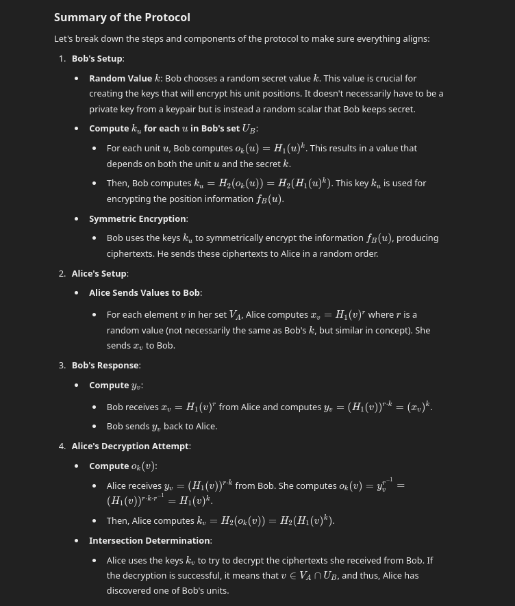

# Private Set Intersection (PSI) Explanation page

## Private Set Intersection (PSI) Overview
Private Set Intersection (PSI) is a cryptographic technique that allows two parties to find common elements in their datasets without revealing any non-matching items. This process ensures privacy, as neither party learns anything about the other’s data beyond the shared elements.

In our example, Alice and Bob are both players in a mock RTS game. Each player has a set of units, and they want to determine if they have any common units without revealing the details of their armies to each other.

How It Works:
1. **Key Exchange**: Alice and Bob begin by following a protocol that enables them to generate and exchange cryptographic keys. This is the foundation for ensuring the privacy of their data throughout the process.

2. **Encrypting Units**: Alice encrypts her units using her key, and Bob does the same with his. After this, they swap their encrypted units. Even though they receive each other’s units, the encryption ensures that neither party can understand the data.

3. **Intersection Identification**: Alice attempts to decrypt Bob's units using the key exchange protocol. If Bob’s unit is also present in Alice’s list, the decryption will reveal it. This is done without Alice learning any other details about Bob's remaining units, ensuring privacy is maintained.

By the end of this protocol, both Alice and Bob only know about the units they have in common, without exposing any other information.

## Protocol Details
Here is a deeper dive into the protocol details. As it is a pain to copy and paste the text from ChatGPT, it is easier to provide a screenshot:

## Key Concepts

### Concept of HashToGroup:
In the research paper there is a hash function, **H1**, which is somewhat different from a regular hash function.

**HashToGroup** typically means hashing an input (like a string or integer) to an element in a cryptographic group. In our case, the group is the elliptic curve group 𝐺, consisting of elliptic curve points.

The goal is to take some arbitrary input, like a string, and map it deterministically to a valid point on the elliptic curve. This is useful in protocols like the one we’re working on because you need inputs (like unit positions) to be represented as curve points for operations like scalar multiplication.

HashToGroup is conceptually similar to HashToCurve, as seen in VRFs, but they are slightly different.

### The H2 Function in the PSI Protocol (PSI Demo):

**Purpose**
The **H2** function in the PSI protocol is designed to map elliptic curve points to a fixed-size bit string (often used for encryption, MACs, or comparison purposes). This bit string could, for instance, be used as a symmetric key in an encryption scheme like AES or for hashing data in a PSI protocol.

It doesn't generate a scalar like in your VRF code, but instead hashes an elliptic curve point (or some other data) to a string of bits.

**Process**
The input (which is often an elliptic curve point, or something derived from it) is hashed to a bit string (e.g., using SHA-256 or SHA-512). This bit string could then be used as a key, for example.

### Elliptic Curve Choice:

#### p256

Also known as prime256v1 or NIST P-256, this curve is part of the NIST (National Institute of Standards and Technology) recommended curves.

It is considered to be potentially backdoored by many professional cryptographers. It is fine for demonstration purposes, but may not be wise in a production setting (when you fear US government snooping).

There is a website that digs into curve safety run by Daniel J. Bernstein and Tanja Lange: [SafeCurves: choosing safe curves for elliptic-curve cryptography](https://safecurves.cr.yp.to/).

#### secp256k

This curve is known for being used in Bitcoin, Ethereum and other cryptocurrencies. It's not part of the NIST family but was defined by SECG (Standards for Efficient Cryptography Group) in SEC 2.

It has the same 128-bit security level as p256, but it's optimized for certain mathematical operations like elliptic curve multiplications, so should be more performant, which is why it's popular in the blockchain world.

### Encrypting units via symmetric encryption:

#### Stream Cipher ChaCha20
Using a stream cipher like [ChaCha20](https://en.wikipedia.org/wiki/Salsa20) is an excellent choice for encrypting and decrypting data, as it’s fast, secure, and widely used in cryptographic systems. In the context of the PSI protocol, Bob will encrypt his unit positions, and Alice will attempt to decrypt the ciphertexts using the keys she calculates during the protocol.

Block ciphers like AES are more heavyweight so are naturally slower than stream ciphers. For gaming, we need speed while being secure enough.
